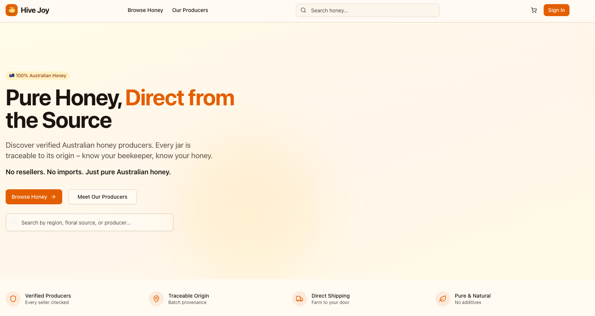

# Hive Joy Marketplace

> The trusted marketplace for authentic Australian honey, connecting verified producers directly with consumers.



## 🍯 About

Hive Joy Marketplace is a digital platform connecting verified Australian honey producers and beekeeping businesses directly with consumers. The platform unites trusted, traceable sellers of honey and hive-derived products under one verified ecosystem—ensuring purity, transparency, and fair trade across the Australian market.

### Vision

To become the national trusted marketplace for Australian honey and hive products—empowering local producers and protecting consumers from counterfeit or imported honey.

### Problem We Solve

Australia's honey industry faces widespread authenticity issues. Imported and blended honey dominates retail shelves, often misleading customers. Local producers lack a unified digital platform to showcase and sell directly, while consumers struggle to identify genuine, traceable Australian honey.

### Our Solution

Hive Joy provides a verified-only marketplace where every seller must be an Australian producer with traceable operations. No resellers or imported products. Each listing includes provenance details, producer profile, and verification badge.

## ✨ Key Features

- **Verified Producers Only**: Sellers must produce their own honey or hive products in Australia
- **Traceable Origin**: Each item links to its source region and beekeeper via batch-based provenance
- **Australian-Only Ecosystem**: Exclusively for Australian businesses and consumers
- **Hive Joy Seal**: Quality certification to identify verified producers
- **Secure Digital Infrastructure**: Web platform + mobile app with integrated payments, geo-filters, and advanced search by floral source or region

## 🚀 Getting Started

### Prerequisites

- Node.js 18+ 
- npm, yarn, pnpm, or bun

### Installation

```bash
# Install dependencies
npm install

# Run development server
npm run dev
```

Open [http://localhost:3000](http://localhost:3000) to see the application.

### Build for Production

```bash
npm run build
npm start
```

## 📁 Project Structure

```
hivejoy/
├── app/                    # Next.js App Router pages
│   ├── (consumer)/        # Consumer-facing pages
│   ├── (seller)/          # Seller/producer pages
│   └── (admin)/           # Admin portal
├── components/            # React components
│   ├── shared/           # Shared components (Header, Footer, etc.)
│   ├── ui/               # UI primitives (shadcn/ui)
│   └── providers/        # Context providers
├── lib/                   # Utilities and API
│   ├── api/              # API functions (mock data)
│   └── stores/             # Zustand state management
└── types/                 # TypeScript type definitions
```

## 🛠️ Tech Stack

- **Framework**: Next.js 16.1.1 (App Router)
- **Language**: TypeScript
- **Styling**: Tailwind CSS v4
- **State Management**: Zustand
- **UI Components**: Radix UI + shadcn/ui
- **Forms**: React Hook Form + Zod
- **PWA**: next-pwa

## 📋 Key Concepts

### Producer Verification
All sellers must go through a verification process proving they are Australian honey producers (not resellers or importers).

### Batch-Based Traceability
Every product listing must be linked to a Batch record containing:
- Region (state/area)
- Harvest date and extraction date
- Floral source tags
- Producer identity

### Platform Rules
1. All sellers must be producers themselves (no resellers, retailers, or importers)
2. Every product listing must be linked to a traceable source via a Batch record
3. Australian market focus for both sellers and buyers
4. Honey is the MVP core product

## 🎯 Roadmap

- [ ] Mobile app (iOS/Android)
- [ ] QR code provenance pages
- [ ] Advanced seller analytics
- [ ] Subscription tiers for producers
- [ ] Featured listings and promotions

## 📄 License

Private - Hive Joy Marketplace

## 👥 Team

Owner: Hive Joy
