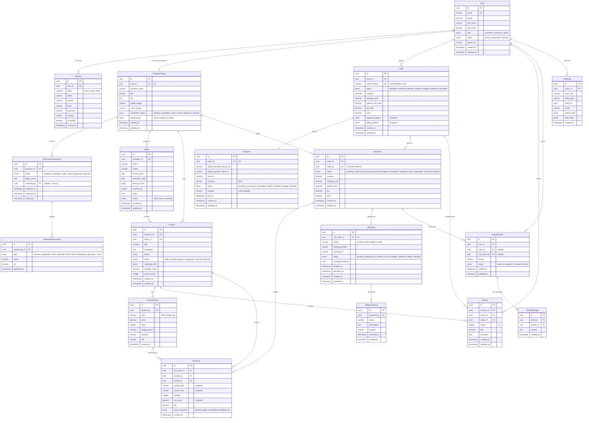

# Hive Joy - Database ER Diagram

## Architecture Overview

The database follows a **marketplace SubOrder pattern** where a single consumer checkout produces one `Order` with one `Payment`, which is then split into `SubOrder`s per seller — each with independent fulfillment, tracking, and return handling.

---

## ER Diagram

---

## Entity Details

### 1. User + ProducerProfile (Split Table Pattern)

- All users share the `User` table (consumer, producer, admin) with a `role` enum.
- Producers get an additional `ProducerProfile` row (1:1 with User) for business-specific fields.
- Admins are just users with `role = 'admin'` -- no extra table needed.
- `Address` is a separate table so users can save multiple shipping/billing addresses.

### 2. Product + Batch (Traceability)

- Each `Product` belongs to one `Batch` (the honey harvest it came from).
- `Batch` stores provenance: harvest date, extraction date, region, floral sources, quantity.
- `Product` stores marketplace data: title, photos, status, nutritional info, average rating.
- `ProductVariant` handles size-based pricing (250g, 500g, 1kg) with independent stock levels.
- `nutritional_info` is stored as JSONB for flexibility (energy, protein, sugars, etc.).
- `average_rating` and `review_count` are denormalized on `Product` for fast display.

### 3. Order -> SubOrder -> OrderItem (Marketplace Pattern)

- **Order**: One per checkout. Holds buyer info, totals, and address snapshots.
- **SubOrder**: One per seller in the order. Each has its own status, shipping cost, and platform fee. This enables independent fulfillment workflows per seller.
- **OrderItem**: Individual line items. Contains price/product snapshots (immutable at purchase time) and a `batch_snapshot` JSONB for honey provenance traceability.
- Addresses are snapshotted as JSONB on the Order (not FK references) so they remain correct even if the user later updates their address.

### 4. Payment (Stripe Integration)

- 1:1 with Order (one payment per checkout).
- Stores both `stripe_checkout_session_id` (from checkout creation) and `stripe_payment_intent_id` (from webhook).
- Status updated via Stripe webhooks: `pending -> processing -> succeeded`.
- Supports refunds: `succeeded -> partially_refunded -> refunded`.

### 5. Shipment + ShipmentEvent (Delivery Tracking)

- **Shipment**: 1:1 with SubOrder. Created when seller packs the sub-order. Stores carrier, tracking number, and high-level status.
- **ShipmentEvent**: Append-only log of tracking updates from the delivery partner (Australia Post, Shippit, etc.). Each event has status, description, location, and timestamp.
- This allows full delivery history reconstruction without overwriting previous states.

### 6. Review

- Tied to a specific product, buyer, and order.
- Composite unique constraint on `(buyer_id, product_id, order_id)` to prevent duplicate reviews.
- `average_rating` and `review_count` on `Product` are updated via trigger or application logic.

### 7. Verification + Documents

- `VerificationSubmission` tracks the review workflow for producer approval.
- `VerificationDocument` stores uploaded files (business registration, food safety certs, etc.).
- Admin decisions are recorded with notes and reviewer ID for audit trail.

### 8. Support + Audit

- `SupportTicket` can be linked to an Order or SubOrder (both nullable for general inquiries).
- `TicketMessage` enables threaded conversations between user and support.
- `AuditLog` records all significant admin/system actions with before/after state snapshots.

---

## Key Indexes

| Index | Purpose |
|-------|---------|
| `User.email` (unique) | Login lookup |
| `ProducerProfile.user_id` (unique) | User-to-profile mapping |
| `Product(producer_id, status)` | Seller's active listings |
| `Product(status, created_at)` | Marketplace browsing |
| `Order.buyer_id` | Consumer's order history |
| `Order.order_number` (unique) | Human-readable order lookup |
| `SubOrder(order_id)` | Sub-orders within an order |
| `SubOrder(seller_id, status)` | Seller's fulfillment queue |
| `Shipment.tracking_number` | Lookup by tracking |
| `Review(product_id, created_at)` | Product review pages |
| `Payment.stripe_checkout_session_id` | Stripe webhook lookups |
